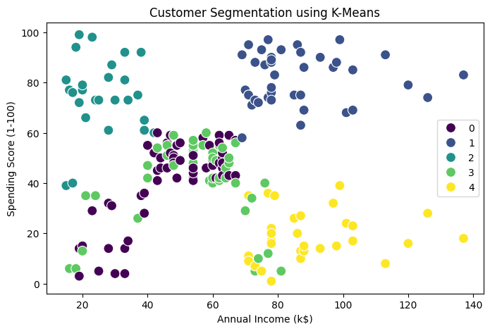

## **KNN-Model Predict Clusters**  
A machine learning-based web app that predicts house prices based on input features. Built with **Flask (Backend), React (Frontend), and a k-Nearest Neighbors (KNN) model**.

### 🔗 **Live Links**  
- **Live Link**: [Live on Vercel](https://sct-ml-2-qaw1-45wfotr0q-sahilraj12032004s-projects.vercel.app/)    
- **GitHub Repository**: [View Code](https://github.com/SahilRaj12032004/SCT_ML_2.git )

- # My Project

## Data Visualization

Here is a sample chart from the analysis:



---

## 📌 **Project Overview**  
This project predicts house prices using a trained **KNN model**. The application is built using:  
- **Frontend**: React (to create an interactive UI)  
- **Backend**: Flask (for handling API requests and serving predictions)  
- **Deployment**: Vercel (for both frontend and backend)  

---

## 🚀 **Features**  
✔️ User-friendly interface to input house details 📊  
✔️ Flask API that serves real-time predictions 📡  
✔️ Machine Learning model (KNN) for accurate predictions 🧠  
✔️ Fully deployed on **Vercel** 🌐  

---

## 🛠 **Tech Stack**  
### **Frontend**:  
- React.js  
- Axios (for API requests)  
- Vercel (for deployment)  

### **Backend**:  
- Python (Flask)  
- Scikit-Learn (for KNN model)  
- Pandas & NumPy (for data processing)  
- Flask-CORS (for handling cross-origin requests)  
- Vercel (for deployment)  

---

## 💡 **Learnings & Challenges**  
### ✅ **Learnings**  
🔹 Building a complete **MERN-like** full-stack project with Flask & React  
🔹 Training & deploying a **KNN model** for real-world use cases  
🔹 Handling **frontend-backend communication** using REST API  
🔹 Deploying full-stack applications on **Vercel**  

### ❗ **Challenges & Solutions**  
⚠ **Backend Deployment Issues** → Fixed by correctly configuring `vercel.json`  
⚠ **CORS Errors** → Solved by adding `Flask-CORS`  
⚠ **Frontend not connecting to Backend** → Ensured the correct API base URL  

---

## 📂 **Project Structure**  
```
/frontend - React App (UI)
/backend  - Flask API (ML Model)
```

---

## ⚙ **Setup & Run Locally**  
### **Clone the Repository**  
```sh
git clone https://github.com/yourusername/your-repo.git
cd your-repo
```

### **Backend Setup**  
```sh
cd backend
pip install -r requirements.txt
python app.py
```

### **Frontend Setup**  
```sh
cd frontend
npm install
npm start
```

---

## 📢 **Future Improvements**  
🚀 Improve model accuracy with more training data  
🚀 Add more ML models for better comparisons  
🚀 Enhance UI for a better user experience  

---

**🔗 Connect with me on LinkedIn**: [My Profile](https://www.linkedin.com/in/sahil-raj-o1/)  

💡 **Contributions, issues, and feedback are welcome!** 🚀 
